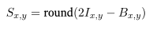
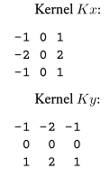
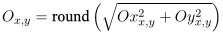

# **PSET - Linguagens de Programação**
## *Processamento de imagem*

Neste respositório está documentado todo o estudo de processamento de imagens e algorítmos relacionados a manipulação das mesmas utilizando cálculos e aplicação de *kernels* para obter efeitos/filtros.

Nos arquivos iniciais fornecidos pelo professor da disciplinas (inclusive os mesmos arquivos fornecidos em sua integra se encontram no primeiro commit do repositório) possuía um script pset1.py onde se encontrava a classe imagem e todos os seus atributos e métodos iniciais, esses métodos o professou já disponibilizou em sua total funcionalidade, e foram utilizados os seguintes métodos ao decorrer do pset:

* carregar(): 
> Carrega uma imagem do arquivo fornecido e retorna uma instância dessa classe representando essa imagem. Também realiza a conversão para tons de cinza.

* nova():
>  Cria imagens em branco (tudo 0) com a altura e largura fornecidas.

* savar():
> Salva a imagem fornecida no disco ou em um objeto semelhante a um arquivo. Se o nome_arquivo for fornecido como uma string, o tipo de arquivo será inferido a partir do nome fornecido. Se nome_arquivo for fornecido como um objeto semelhante a um arquivo, o tipo de arquivo será determinado pelo parâmetro 'modo'.

* mostrar():
> Mostra uma imagem em uma nova janela Tk, da biblioteca do tkinter.
---

Vale ressaltar que nesse arquivo possui orientações, como por exemplo não ser permitido importar outras bibliotecas além do que já constavam no script, então por esse motivo não foi utilizada o Numpy por exemplo para trabalhar com as matrizes das imagens.

Além desse script com todo o algorítmo de processamento das imagens, há também um arquivo python para testes unitários, ao final da conclusão de todas as questões do PSET o objetivo é concluir a execusão desse script com todos os testes tendo seu resultado como **'OK'**. Em resumo os testes unitários comparam os resultados gerados do algorítmo criado, com resultados esperados de imagens já disponibilizadas pelo professor em um diretório.

## Sobre a classe *Imagem*

* Atributos:
    - largura;
    - altura;
    - quantidade de pixels.

* Métodos:
    - get_pixel
        > Para obter o valor do pixel.
    
    - set_pixel
        > Para aplicar novo valor do pixel.

    - aplicar_por_pixel:
        > Obtém o valor de cada pixel da imagem aplicando novo valor aos mesmos.
    
    - aplicar_kernel
        > Essa função aplica um kernel a uma imagem, através do cálculo de correlação linear orientado no PSET,retornando uma nova imagem com os valores calculados para apllicar os filtros.

    - invertida
        > Essa função utiliza do método *aplicar_por_pixel* para inverter os valores de cada pixel da imagem, utilizando o seguinte cálculo: `lambda c: 255 - c`.

    - borrada
        > Função para borrar a imagem, ela utiliza o método já criado *aplicar_kernel*, e basicamente cria um kernel de acordo com as orientaçõs do PSET, um desfoque de caixa é um kernel de matriz quadrada n x n, de valores identicos que soman 1, para que seja feito essa lógica o seguinte cálculo foi utilizado: `pixels_kernel  = 1 / (n * n)`, e é isso que a variável 'pixels_kernel' se encarrega de fazer.

    - focada
        > Esse método aplica um filtro de imagem com mais nitidez, o cálculo para esse efeito foi dado no PSET 

    - bordas
        > Aplica um efeito que destaca as bordas dos elementos presentes na imagem, utilizando um operador Sobel, este detector de borda é mais complexo do que um kernel simples de imagem, mas é uma combinação de dois kernels de imagem Kx e Ky: 
        >  
        >Após calcular Ox e Oy correlacionando a entrada com Kx e Ky respectivamente, cada pixel da saída é a raiz quadrada da soma dos quadrados dos pixels correspondentes em Ox e Oy:
        > 

* Observações:
    - Todos os métodos foram implementados respeitando os valores dos pixels dentro da escala de cinza, com os utilitários min() e max(), além de utilizar o round() para o arredondamento de valores não inteiros.
        

